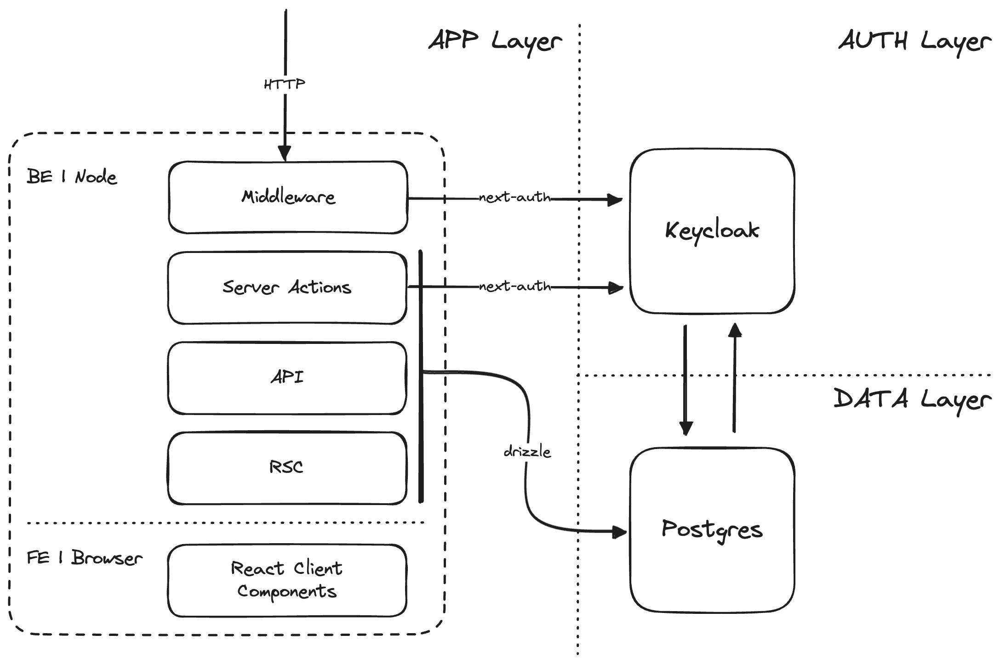

# Acme App

This is template for GELLIFY fullstack app. A [T3 Stack](https://create.t3.gg/) project bootstrapped with `create-t3-app` and configured to use the best integrations for our standard projects.

## What's next? How do I make an app with this?

We try to keep this project as simple as possible, so you can start with just the scaffolding we set up for you, and add additional things later when they become necessary.

If you are not familiar with the different technologies used in this project, please refer to the respective docs. If you still are in the wind, please refer to the [Documentation](https://create.t3.gg/) and the [T3 Stack Tutorial](https://create.t3.gg/en/faq#what-learning-resources-are-currently-available).

- [Next.js](https://nextjs.org)
- [NextAuth.js](https://next-auth.js.org)
- [Drizzle](https://orm.drizzle.team)
- [Tailwind CSS](https://tailwindcss.com)
- [Shadcn/ui](https://ui.shadcn.com)

## What's the architecture of this app?

In this stack we tried to follow all of the best practices of the different components that are used to enable the various features. In order to offer some default we pre-configured the following layers:

- App Layer, a standard [Next.js](https://nextjs.org) app
- Auth Layer, a Keycloak instance wrapped with [NextAuth.js](https://next-auth.js.org)
- Data Layer, a Postgres instance managed by [Drizzle](https://orm.drizzle.team)

Below you can find a diagram representing an high level overview of architecture we strived to implement. This fullstack template aims to reduce complexity, increase DX and reduce dependencies overhead.



### Architecture - App Layer

TODO

### Architecture - Auth Layer

For authentication and authorization we choose Keycloak provider. In this template Auth is configured out-of-the-box with some defaults that can be modified.

- Keycloak configuration, `/keycloak/realm.json`
- Keycloak Admin, `.env`

Comunication with Keycloak is handled via [NextAuth.js](https://next-auth.js.org). This choice enbles you the Developer to change Idendity Provider is needed, without much effort. See the relative [documentation](https://next-auth.js.org/providers/) to find out more.

### Architecture - Data Layer

A standard Postrges Database is the default. Both the App and Keycloak will use the same DB (but different schemas) to handle their respective business logic.

[Drizzle](https://orm.drizzle.team) is the ORM used to manage the the DB and this is the case for several reasons:

- Can handle almost every relational databases, so switching can be done pretty easily.
- NextAuth has a Drizzle adapter to access the underling DB, giving both the _App Layer_ and the _Auth Layer_ a standard way to manage data.
- Easy way to handle schema push, migrations and seeding of the DB

**Why not Prisma?**

1. Prisma needs a generation step to be typesafe where Drizzle is 100% typescript
2. Prisma handle query under the hood, making impossible for the Developer to optimize or take control of a given query.

## How do I start developing with this?

### Requirements

- Docker or Podman
- Node Version Manager ([fnm](https://github.com/Schniz/fnm) **reccomended** to switch version automagically)

### Getting started

1. First you have to create a copy of the environment variables.

```sh
cp .env.example .env
```

2. Then start the localstack needed for development. We need a Postgres instace, a Keycloak server and we should also push DB schema + seed. All of the above can be done with a pre-configured script

```sh
./start-localstack.sh
```

3. Run the actual Next.js development server

```sh
pnpm run dev
```

## How do I deploy this?

Follow our deployment guides for [Vercel](https://create.t3.gg/en/deployment/vercel), and [Docker](https://create.t3.gg/en/deployment/docker) for more information.
